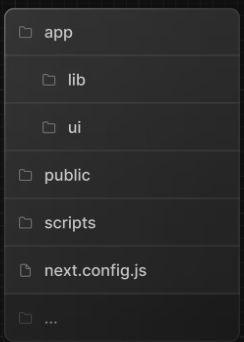
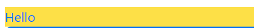
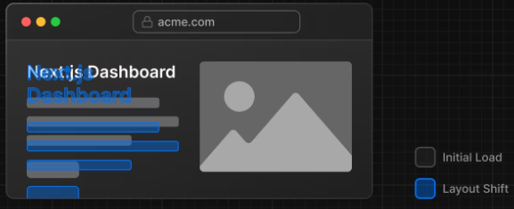
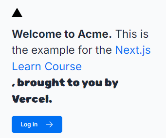

# Next.jsについて

の前に、`onpm`の使用が推奨されている。  
理由: npmより高速かつ効率的であるから
```sh
npm install -g pnpm
```

## プロジェクトフォルダの構造


`/app`: アプリケーションのすべてのルート、コンポーネント、ロジックが含まれており、主にここで作業を行います。

`/app/lib`: 再利用可能なユーティリティ関数やデータ取得関数など、アプリケーションで使用される関数が含まれます。

`/app/ui`: カード、テーブル、フォームなど、アプリケーションのすべての UI コンポーネントが含まれています。時間を節約するために、これらのコンポーネントは事前にスタイル設定されています。

`/public`: 画像など、アプリケーションのすべての静的アセットが含まれます。

## 開発サーバーの実行

パッケージのインストール
```sh
pnpm i
```
devサーバーの起動
```sh
pnpm dev
```

## CSSについて

ルートレイアウト: global.css  
以下で読み込む。プロジェクト作成時にtailwindがONになったらtailwind用の記載も書かれる。
```js
import '@/app/ui/global.css';
```

書き方
```html
<main className="flex min-h-screen flex-col p-6"></main>
```
### clsxクラスを使用して見た目を制御する
```js
import clsx from 'clsx';


export default function Flg() {
  const flg = true
  return (
    <p className={clsx(
            'text-blue-500',
            {
              'bg-yellow-300': !flg,
              'bg-green-500': flg,
            }
          )}>Hello</p>
    // ...
)}
```


### CSSモジュールを使う場合
例) /app/ui/home.module.css
```css
.shape {
  height: 0;
  width: 0;
  border-bottom: 30px solid black;
  border-left: 20px solid transparent;
  border-right: 20px solid transparent;
}
```

## フォントと画像の最適化

### フォントの読み込み
イメージ。自動でレイアウトやフォントを最適化


**/app/ui/fonts.ts**
```ts
import { Inter } from 'next/font/google';
// フォントによって色々なクラスの種類があるので、
// 都度インポートする(例: Instrument_Serif)
// GoogleFont参照
export const inter = Inter({ subsets: ['latin'] });
```
**/app/layout.tsx**
```ts
import '@/app/ui/global.css';

import { inter } from '@/app/ui/fonts';
 
export default function RootLayout({
  children,
}: {
  children: React.ReactNode;
}) {
  return (
    <html lang="en">
      <body className={`${inter.className} antialiased`}>{children}</body>
    </html>
  );
}
```
`antialiased`はフォントを滑らかにするクラス。  
使用すると素敵なタッチが追加されます。  

特定の要素にもクラスを割り当ててあげればフォントを変更することができる。



### 画像の読み込み
imgタグは使わず、Imageコンポーネントを使うようにする。
```js
import Image from 'next/image';
...
<Image
    src="/hero-desktop.png"
    // public直下の画像を参照している。
    width={1000}
    height={760}
    className="hidden md:block"
    alt="Screenshots of the dashboard project showing desktop version"
    />
```

### 参考ドキュメント
[画像最適化ドキュメント](https://nextjs.org/docs/app/building-your-application/optimizing/images)  
[フォント最適化ドキュメント](https://nextjs.org/docs/app/building-your-application/optimizing/fonts)