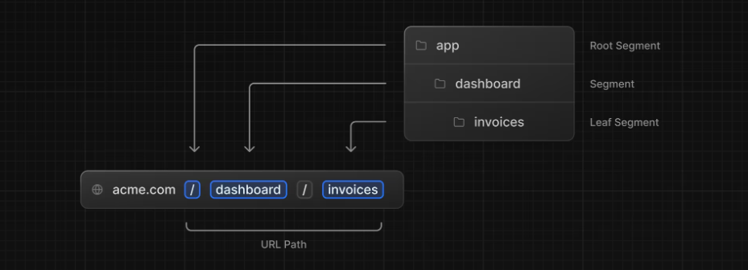
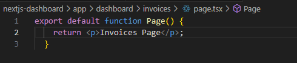
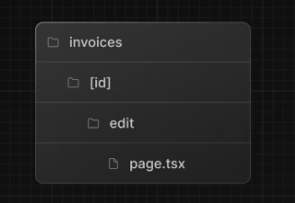

## ネストされたルーティング

Next.js は、フォルダーを使用してネストされたルートを作成するファイル システム ルーティングを使用します。

`layout.tsx`および`page.tsx`を使用して、ルートごとに個別の UI を作成できます。  
ネストされたルートを作成するには、フォルダーを互いにネストし、`page.tsx`その中にファイルを追加します。

例)
以下のフォルダ構成の場合、  
`http://localhost:3000/dashboard/invoices`  
にてアクセスできる



### レイアウト

Next.js では、特別な`layout.tsx`ファイルを使用して、  
複数のページで共有される UI を作成できます。  

作成したフォルダ以下のpageでlayout.tsxが適用される。

一階層前のフォルダでも`layout.tsx`を設定した場合は、  
レイアウトは2つ適用される。(両方のレイアウトが適用される。)

`/app/layout.tsx`は**ルートレイアウト**と呼ばれ、必須となる。  
これは全てのページで共有される。  
**/app/layout.tsx**
```js
import '@/app/ui/global.css';
import { inter } from '@/app/ui/fonts';
 
export default function RootLayout({
  children,
}: {
  children: React.ReactNode;
}) {
  return (
    <html lang="en">
      <body className={`${inter.className} antialiased`}>{children}</body>
    </html>
  );
}
```

### 部分レンダリング

同じ階層以下で`layout.tsx`を使いまわしていた場合、  
ナビゲーション時に`page.tsx`のページコンポーネントのみが更新されて、  
レイアウトは再レンダリングされないこと

### ページ間の移動

**aタグ**...ページ遷移時にページ全体が更新されてしまう

Next.js では、`<Link />`コンポーネントを使用してアプリケーション内のページ間をリンクできます。  
→aタグの代わりにこれを使う  
→ページが更新されることが無くなった。  
`<Link href="…">`

### 自動コード分割とプリフェッチ

Next.jsではルートごとにアプリを自動的にコード分割している。  
初期読み込み時、すべてのアプリケーションコードを読み込む。  
→ 特定のページでエラーが起きてもアプリの残りの部分は引き続き動作する

本番環境では`<Link>`コンポーネントがブラウザに表示されるたびに  
リンク先のページをバックグラウンドで読み込む。  
そのため、ページ遷移が瞬時に行われているように感じる。

### 現在のパスを取得する

```js
'use client'; // 記載しないと怒られる

import { usePathname } from 'next/navigation';

export default function NavLinks() {
  const pathname = usePathname();
  // ...
}
```

`http://localhost:3000/dashboard/customers`
が現在のパスなら、
`pathname`には`/dashboard/customers`が入る。  

`use client`は、サーバー コンポーネントモジュールとクライアントコンポーネント モジュール間の境界を宣言するために使用されます。  
→ App Router のすべてのコンポーネントがサーバー コンポーネントであり、これらの API は利用できないため  
→ importすると、子にも影響があるため、わざわざ各コンポーネントで宣言する必要はない。  

[Using Client Components in Next.js](https://nextjs.org/docs/app/building-your-application/rendering/client-components#using-client-components-in-nextjs)

## 動的ルートセグメント

例えば、URLにユーザーのIDをセットしてリクエストする場合を考える。

```js
<Link
    href={`/dashboard/invoices/${id}/edit`}
    className="rounded-md border p-2 hover:bg-gray-100"
    >
```

このように`Link`コンポーネントに`href`を設定して、アクセスする。  
すると、下記のようなディレクトリ構造下にある`page.tsx`に移動する。



`page.tsx`では以下のようにして`[id]`の値を受け取ることができる。

```ts
import Form from '@/app/ui/invoices/edit-form';
import Breadcrumbs from '@/app/ui/invoices/breadcrumbs';
import { fetchCustomers } from '@/app/lib/data';
 
export default async function Page({ params }: { params: { id: string } }) {
  const id = params.id;
  // ...
}
```