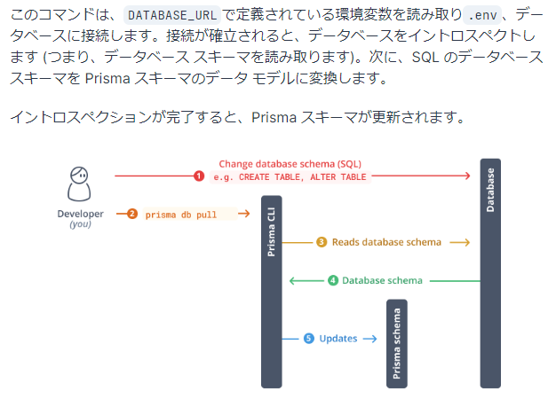

## Prismaとは

JavascriptでのORM

### インストール

ルートディレクトリでPrismaをインストール
```sh
pnpm install prisma --save-dev
```

Prismaスキーマファイルテンプレートを作成し、PrismaORMプロジェクトを設定
```sh
pnpm prisma init
```

すると以下のようなファイルが出来上がる
```prisma
// This is your Prisma schema file,
// learn more about it in the docs: https://pris.ly/d/prisma-schema

generator client {
  provider = "prisma-client-js"
}

datasource db {
  provider = "sqlite"
  url      = env("DATABASE_URL")
}
```
上記はSQ LiteでDBを作ろうとしている。

## 既存のDBをスキーマファイルに落とし込む方法

[既存のプロジェクトに追加](https://www.prisma.io/docs/getting-started/setup-prisma/add-to-existing-project/relational-databases-typescript-postgresql)

テンプレートを書き換える    

```
generator client {
  provider = "prisma-client-js"
}

datasource db {
  provider  = "postgresql"
  url       = env("POSTGRES_PRISMA_URL")
  directUrl = env("POSTGRES_URL_NON_POOLING")
}
```
上記は`Vercel`の`Postgres`に接続する場合。  
接続したら以下コマンドでDB定義をファイルに起こす。
`イントロスペクト`

```sh
pnpm prisma db pull
```


## ゼロから定義してDBにスキーマを設定する

[ゼロから始める](https://www.prisma.io/docs/getting-started/setup-prisma/start-from-scratch/relational-databases-typescript-postgresql)

DB URLを設定してDBに接続する準備をする。

[データモデル](https://www.prisma.io/docs/orm/prisma-schema/data-model)をもとに各テーブルを定義する。

定義が終わったら下記コマンドを実行。
```sh
pnpm prisma migrate dev --name init
# "init"にマイグレート時の名前を付けることができる
```

変更したい場合は、`schema.prisma`の定義を書き換えて、`migrate`コマンドを実行する。  
そうすると、DBが更新される。

## GUIでDBの中身を操作する。

```sh
pnpm prisma studio
```
`Prisma Studio is up on http://localhost:5555`  
このように出力があるので、このアドレスにアクセスすればGUIでDBの中身が確認できる。

## その他のPrisma CLIコマンド

[Prisma CLI リファレンス](https://www.prisma.io/docs/orm/reference/prisma-cli-reference)