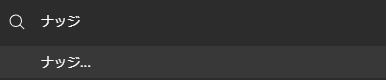
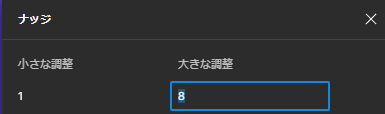
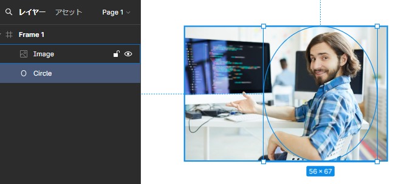
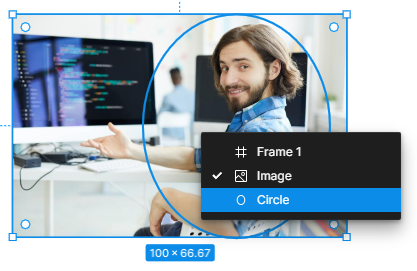
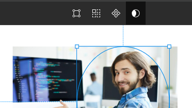
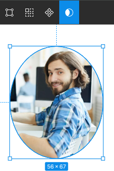

## 前準備

#### ナッジ

キーボードの→キーを使って要素を動かす操作を**ナッジ**という  
ナッジを使うと、ちょっと便利に。  

クイックアクション `ctrl + / `

ここで`Shift + →`を押下すると、ちょうど8pt移動することになる。

#### スナップ

位置やサイズを整数に直してくれる。  
上と同様に`クイックアクション`を開いて`スナップ`と検索  
以下にチェックがついていることを確認  

- ピクセルグリッドにスナップ
- ジオメトリにスナップ
- オブジェクトにスナップ

## フォント

明朝体 ≒ セリフ体(serif)  
ゴシック体 ≒ サンセリフ体(Sans-serif)   

## マスクの手順

1. 上の層に画像、下の層に切り抜きたい形を配置する。  

2. `Ctrl + 右クリック`で重なっている要素がリストで表示されるので、型を選択する  

3. マスクボタンを押す  

4. マスクできた。  
