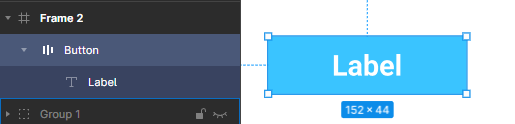
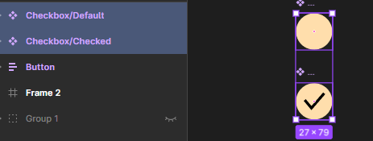
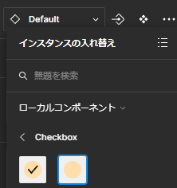

  
このようなプロパティを持つボタンを作りたい。

- State(ボタンの状態)
- Rounded(形が丸いか否か)
- hasicon(アイコンがあるか無いか)
- icon(アイコンの種類)
- Content(文字列)

## 単一なコンポーネントを作成

適当にボタンを作る。  

上部のクローバー(?)のような形のボタンを押して`Button`をコンポーネント化する。  
 → 

バリアントを追加して、`Button`にバリエーションを持たせる。  

コンポーネントグループを選択して、プロパティが初期時に出来ているので、それを適切なものに書き換える。  
  

下記のような形で3種類作成。  

次にBoolのプロパティを作ってみる。  
もう一度コンポーネントグループを選択して、右上の「+」から`バリアント`を選択する。  

以下のように設定。  
※これは今現在あるコンポーネントに新規でプロパティを設定している。  
 

角が丸いボタンも作成しておく。  
色も一から設定しないといけない。  

※たまに下記のような表示がされることがあるが、その場合はプロパティの場合分けが被っていることを指しているので、見直す。  

## 他のコンポーネントを入れ子にする。

簡単な2つのコンポーネントを作っておく。  
それぞれ別のコンポーネントにした方が後々便利なので注意。  

アセットからインスタンスを挿入して、`Button`コンポーネントと結合させる。  
 

「インスタンスの入れ替え」を行うことで、チェック無バージョンと入れ替えることができる。  
 

これを踏まえて、まず子要素の`checkbox`を選択して、レイヤーの横のボタンを押す。  
 

「hasicon」としてプロパティを作成する。これによって、アイコンの表示非表示を制御できる。  
  

そのまま`checkbox`コンポーネント横のボタンも押して、切り替えたいインスタンスを選択する。  
 

すると、`Button`インスタンスを挿入した際に色々プロパティ指定できる。  

## ラベルのプロパティ

親のコンポーネントを選択  

ラベルインプット横のボタンを押下する。以上。  
 

