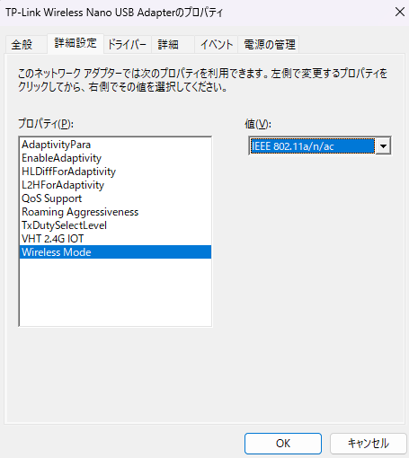
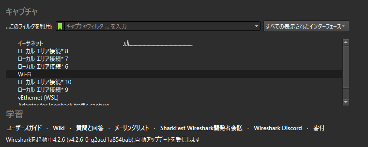

# 無線LANをプロミスキャスモードにする方法

「プロミスキャスモード」に設定することによって、自分宛てでないパケットも傍受できるようになる。  
つまり、通常は『PC-LAN』のパケットしか確認できないが、『iPhone-LAN』のパケットも確認できるということ

デバイスマネージャ > ネットワークアダプタ > 使用しているアダプタのプロパティを開く  

この設定でOKを押下して、「デバイスの無効化」→「デバイスの有効化」で再起動

# iPhoneのネイティブアプリの通信を確認する

iPhoneのMACアドレスを確認する

WireSharkを起動して「Wifi」を押下する。

