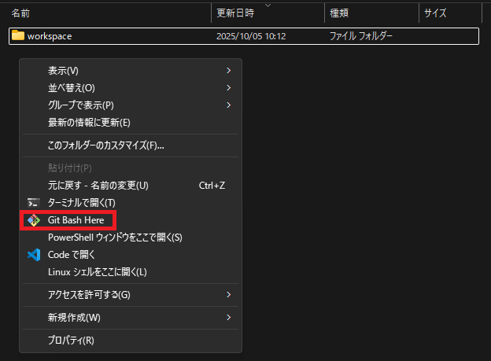

# エクスプローラーから Gitbash を開く方法

任意の場所に `git-bash-here.reg` ファイル(名前は任意)を作成し、以下の内容を書き込む。

```reg
Windows Registry Editor Version 5.00

[HKEY_CLASSES_ROOT\Directory\Background\shell\git_bash]
@="Git Bash Here"
"Icon"="C:\\Program Files\\Git\\git-bash.exe"

[HKEY_CLASSES_ROOT\Directory\Background\shell\git_bash\command]
@="\"C:\\Program Files\\Git\\git-bash.exe\" \"--cd=%V\""
```

それを実行したら以下のようにカレントディレクトリを Gitbash で開くことができる。



設定を元に戻したい場合は `remove-git-bash.reg` を作成し、以下を書き込み実行する。

```
Windows Registry Editor Version 5.00

[-HKEY_CLASSES_ROOT\Directory\Background\shell\git_bash]
```
