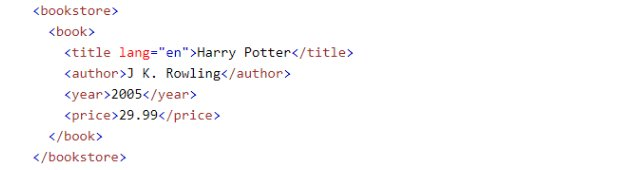

[Seleniumブラウザー自動化プロジェクト](https://www.selenium.dev/ja/documentation/)  
けっこうぐちゃぐちゃ

## 概要

### Wait

[Wait](https://www.selenium.dev/ja/documentation/webdriver/waits/)

**Implicit waits**  
セッション全体に適用。  
特定の要素を見つける際のタイムアウトを設定する。  
この値が`0`の場合は、要素が見つからなかった場合、すぐさまエラーを返す。  
ただ、ページレンダリングに時間がかかり、すぐ表示されないような場合には、待機時間を指定する。

```python
driver.implicitly_wait(2)
```

**Explicit waits**  
特定のセッションに適用。  
Implicit waitsとは異なり、特定の要素の出現時間だけが時間かかる場合にはこちらを使う。
```python
wait = WebDriverWait(driver, timeout=2)
wait.until(lambda d : revealed.is_displayed())
```

## チートシート

[最初のSeleniumスクリプトを書く](https://www.selenium.dev/ja/documentation/webdriver/getting_started/first_script/)

##　使用例
もっといい記述がありそうだが  
```python
# ChromeDriverをセットアップ
service = Service(ChromeDriverManager().install())

class Driver:
    def __init__(self, target_url:str, frame:str=None) -> None:
        self.driver = webdriver.Chrome(service=service)
        self.driver.get(target_url)
        if frame:
            # iframeを使っていた場合は、こちらにフレーム名を設定する。
            self.driver.switch_to.frame(frame)
        # 明示的な待機(多分ここでは暗黙的な待機で宣言した方がいい。)
        self.wait = WebDriverWait(self.driver, 10)

mainDriver = Driver(
    target_url="http://www.~",
    frame="iframe"
)

# name属性がidのものを取得し、そこに特定の文字を入力
id_field = self.wait.until(EC.presence_of_element_located((By.NAME, "id")))
id_field.send_keys("my_id")

# ボタンを取得してクリック
button = mainDriver.wait.until(
    EC.element_to_be_clickable(
        (By.XPATH, '//input[@type="submit" and @value="ボタンの文字"]')
    )
)
button.click()

# li要素の「アイテム名」直下のラジオボタンを取得
radio_button = self.wait.until(
    EC.element_to_be_clickable(
        (By.XPATH, '//td[text()="アイテム名"]/following-sibling::td//input[@type="radio"]')
    )
)

```

## XPathの仕組み

XPathは、XMLやHTMLドキュメントのツリー構造内の要素を指し示すために使用されます。例えば、下記の画像はHTMLドキュメントの一部です。 


タグは通常、開始タグ（例：<book>）と終了タグ（例：</book>）で囲まれた間にコンテンツを含んでいます。XPathを用いてこれらの要素にアクセスする際には、スラッシュ（/）を使用して各レベルを区切り、特定の要素に到達します。

＜例＞  

<tag>(開始タグ)ここにコンテンツが入ります… </tag>(終了タグ)  

この方法は、ファイルシステムにおけるディレクトリのパスを指定する方法に似ています。  

例えば、「author」という名前のファイルに到達するためのXPathは、次のようになります。  

＜例＞
/bookstore/book/author  

また、コンピューター上のすべてのファイルには独自のパスがあるように、Webページ上の要素もパスがあります。そのパスはXPathで記述されています。  

ルート要素（ドキュメントの一番上の要素）から始まり、中にあるすべての要素を経由して目標要素に至るXPathは、絶対XPathと呼ばれます。しかし、絶対XPathは非常に長く複雑になる可能性があります。  

＜例＞  

/html/body/div/div[1]/div[2]/div/div/span[1]/span[2]/span[3]...  

そのため、より短い形式を使用することが一般的で、// を使って絶対パスを省略し、任意のレベルから始めることが可能です。これにより、//author のように単純化して記述できます。  

必要な要素を直接指定することで、文書の構造が変わっても柔軟に対応できるため、ぜひ覚えておきましょう。例えば、「author」に到達するには次のように指定できます。  

＜例＞

絶対XPath：/bookstore/book/author  
短いXPath：//author