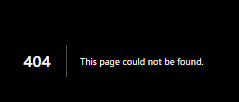
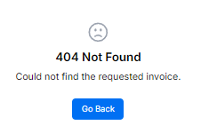
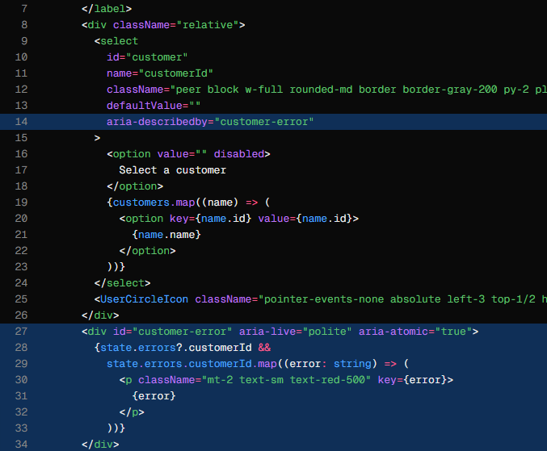
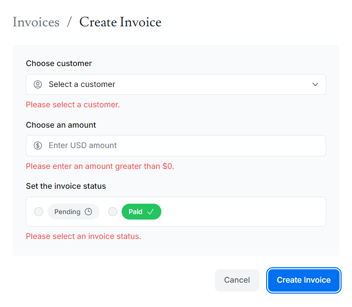

## すべてのエラー

`page.tsx`と同じ階層に`error.tsx`を配置することで、  
全てのエラーをキャッチすることができる。

```js
'use client';
 
import { useEffect } from 'react';
 
export default function Error({
  error,
  reset,
}: {
  error: Error & { digest?: string };
  reset: () => void;
}) {
  useEffect(() => {
    // Optionally log the error to an error reporting service
    console.error(error);
  }, [error]);
 
  return (
    <main className="flex h-full flex-col items-center justify-center">
      <h2 className="text-center">Something went wrong!</h2>
      <button
        className="mt-4 rounded-md bg-blue-500 px-4 py-2 text-sm text-white transition-colors hover:bg-blue-400"
        onClick={
          // Attempt to recover by trying to re-render the invoices route
          () => reset()
        }
      >
        Try again
      </button>
    </main>
  );
}
```

`use client`: クライアント コンポーネントである必要があります。

`error`: JavaScriptのネイティブインスタンス

`reset`: エラー境界をリセットする関数。  
実行すると、この関数はルートセグメントの再レンダリングを試みます。

## 404 Not Found [デフォルト]

```js
import { notFound } from 'next/navigation';

// ...
if (!invoice) {
notFound();
}
```


## 404 Not Found [オリジナル]


画像のように`not-found.tsx`を配置する。

```js
import Link from 'next/link';
import { FaceFrownIcon } from '@heroicons/react/24/outline';
 
export default function NotFound() {
  return (
    <main className="flex h-full flex-col items-center justify-center gap-2">
      <FaceFrownIcon className="w-10 text-gray-400" />
      <h2 className="text-xl font-semibold">404 Not Found</h2>
      <p>Could not find the requested invoice.</p>
      <Link
        href="/dashboard/invoices"
        className="mt-4 rounded-md bg-blue-500 px-4 py-2 text-sm text-white transition-colors hover:bg-blue-400"
      >
        Go Back
      </Link>
    </main>
  );
}
```



## inputなどの下にエラーメッセージを出すとき



input側に`aria-describedby="customer-error"`  
エラーメッセージ要素側に`id="customer-error"`を記載すると、  
要素とエラーメッセージコンテナーの関係が確立される。

`aria-live="polite"`: ユーザーがエラーを修正したとき、スクリーン リーダーはこれらの変更を通知しますが、ユーザーの邪魔にならないように、ユーザーがアイドル状態のときにのみ通知します。

