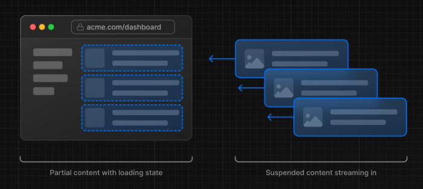
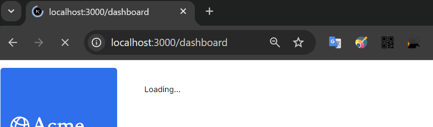
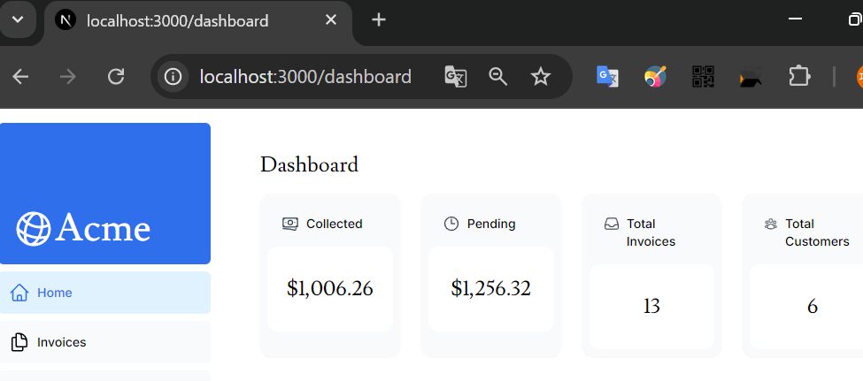
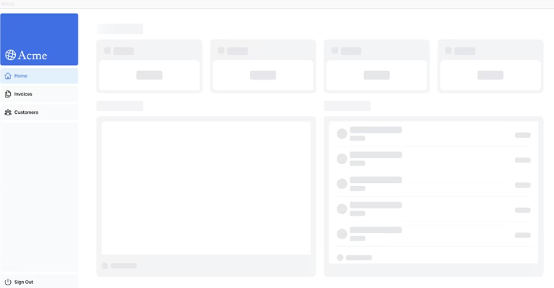
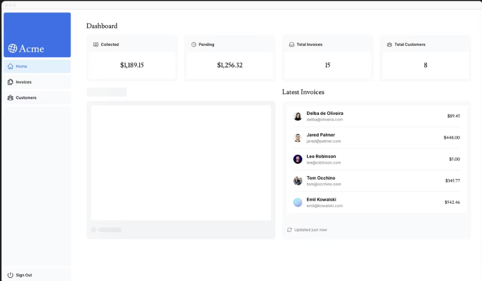

## 静的レンダリングとは

静的レンダリングでは、  
データの取得とレンダリングは、ビルド時 (デプロイ時) または  
データの再検証時にサーバー上で行われる。

静的なブログ投稿や製品ページなど、  
データのないUIやユーザー間で共有されるデータには便利。

定期的に更新されるパーソナライズされたデータを持つ  
ダッシュボードには適さない可能性がある。

## ダイナミックレンダリングとは

静的レンダリングの逆。  
リアルタイムデータや頻繁に更新されるデータを表示することができる。

**リクエスト時の情報**  
動的レンダリングを使用すると、  
Cookie や URL 検索パラメータなど、  
リクエスト時にのみ知ることができる情報にアクセスできる。

!!! Warning
    1つのデータ要求がほかの全ての要求よりも遅い場合、アプリの速度は最も遅いデータ取得速度と同じになってしまう。

## ストリーミング

ルートを小さな「チャンク」に分割し、  
準備が整うと、サーバーからクライアントに段階的にストリーミングができる転送技術



!!! Success
    ストリーミングにより、低速なデータ要求によってページ全体がブロックされることを防ぐことができます。

### 実装方法

`/app/dashboard`フォルダ内に、  
`loading.tsx`を作成
```js
export default function Loading() {
  return <div>Loading...</div>;
}
```

読み込み中は「Loading...」と表示されており、


読み込み完了後に画面が表示された


ページ コンテンツの読み込み中に代わりに表示されるフォールバック UI を作成出来る。  
ユーザーはページの完了を待たずに別画面に行くなど、  
読み込みに関係ない箇所の操作はできる。

スケルトンを使うのもあり。


!!! Success
    `page.tsx`でストリーミングするより、  
    特定のコンポーネントでデータをfetchしてloadingする方が、  
    他のコンポーネントに影響が出ず、良い。 
 

グラフの作成に多大なデータ読み込み時間がかかっており、  
ページ全体をストリーミングしたら読み込みが完了しているコンポーネントも表示されなくなっているので  
特定のコンポーネントのみでストリーミングを行っている。


### Suspenseフォールバック
`<Suspense>` を使うことで、子要素が読み込みを完了するまでフォールバックを表示させることができます。

```js
<Suspense fallback={<Loading />}>
  <SomeComponent />
</Suspense>
```
例えば、今までpages.tsxでデータをフェッチしていたとする。  
そのフェッチを`SomeComponent`コンポーネント内で行う。  
読み込み中は`Loading`コンポーネントが表示される。

### まとめてストリーミング

Cardとかの場合、読み込みが終わったものから順次表示していくとしたら、  
表示がバラバラになってしまい、返って見づらくなってしまうことがある。

その場合は、コンポーネントをグループ化する。  
そうした場合、全ての読み込みが完了した段階で表示される。

**/app/dashboard/page.tsx**
```js
<Suspense fallback={<CardsSkeleton />}>
    <CardWrapper />
</Suspense>
```

**/app/ui/dashboard/card.tsx**
```js
// ...
import { fetchCardData } from '@/app/lib/data';
 
// ...
 
export default async function CardWrapper() {
  const {
    numberOfInvoices,
    numberOfCustomers,
    totalPaidInvoices,
    totalPendingInvoices,
  } = await fetchCardData();
 
  return (
    <>
      <Card title="Collected" value={totalPaidInvoices} type="collected" />
      <Card title="Pending" value={totalPendingInvoices} type="pending" />
      <Card title="Total Invoices" value={numberOfInvoices} type="invoices" />
      <Card
        title="Total Customers"
        value={numberOfCustomers}
        type="customers"
      />
    </>
  );
}
```

## サスペンスの境界線をどこに置くか

1. ページのストリーミング中にユーザーにどのようにページを体験してもらいたいか。
2. 優先したいコンテンツ。
3. コンポーネントがデータ取得に依存している場合。

## 部分的な事前レンダリング

以下の設定にてPPRが有効になり、パフォーマンス向上がみられることもある。  
[Partial prerendering: Building towards a new default rendering model for web applications](https://vercel.com/blog/partial-prerendering-with-next-js-creating-a-new-default-rendering-model)

[参考資料: PPR - pre-rendering新時代の到来とSSR/SSG論争の終焉](https://zenn.dev/akfm/articles/nextjs-partial-pre-rendering)

**next.config.mjs**
```js
/** @type {import('next').NextConfig} */
 
const nextConfig = {
  experimental: {
    ppr: 'incremental',
  },
};
 
export default nextConfig;
```

**/app/dashboard/layout.tsx**
```js
import SideNav from '@/app/ui/dashboard/sidenav';
 
export const experimental_ppr = true;
 
// ...
```