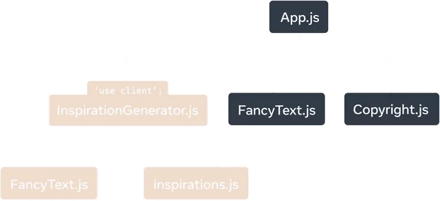
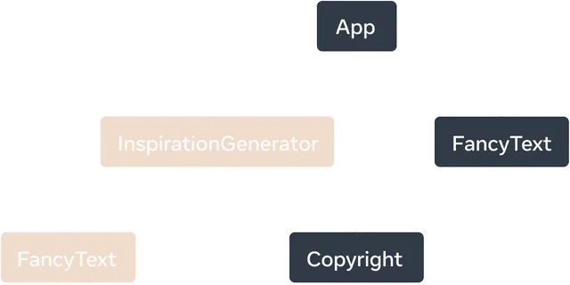

# `use client` ディレクティブ

See the React [documentation](https://react.dev/reference/rsc/use-client) for more information on use client.

`use client` ディレクティブは、クライアント側でレンダリングされるコンポーネントを指定します。これは、状態管理、イベント処理、ブラウザ API へのアクセスなど、クライアント側の JavaScript 機能を必要とするインタラクティブなユーザー インターフェイス (UI) を作成するときに使用する必要があります。これは React の機能です。

デフォルトでは、すべてのコンポーネントは **サーバーコンポーネント** として扱われます。クライアントでのインタラクティブなレンダリング（例：`useState`や`useEffect`を使った状態管理）を必要とするコンポーネントには、このディレクティブを使用してクライアントコンポーネントであることを指定します。

## 使用例

コンポーネントをクライアント コンポーネントとして指定するには、インポートの前に、ファイルの先頭に use client ディレクティブを追加します。

```javascript
// client-component.js
"use client";

import { useState } from 'react';

export default function ClientComponent() {
  const [count, setCount] = useState(0);

  return (
    <button onClick={() => setCount(count + 1)}>
      Count: {count}
    </button>
  );
}
```

## サーバーコンポーネント内にクライアントコンポーネントをネストする

サーバー コンポーネントとクライアント コンポーネントを組み合わせると、パフォーマンスとインタラクティブ性の両方を備えたアプリケーションを構築できます。

1. サーバー コンポーネント: 静的コンテンツ、データ取得、SEO に適した要素に使用します。

2. クライアント コンポーネント: 状態、効果、またはブラウザー API を必要とするインタラクティブ要素に使用します。

3. コンポーネントの構成: サーバー コンポーネント内にクライアント コンポーネントを必要に応じてネストし、サーバー ロジックとクライアント ロジックを明確に分離します。

次の例では、

`ヘッダー`は静的コンテンツを処理するサーバー コンポーネントです。
`カウンター`はページ内でのインタラクティブ性を可能にするクライアント コンポーネントです。

```javascript
import Header from './header'
import Counter from './counter' // This is a Client Component
 
export default function Page() {
  return (
    <div>
      <Header />
      <Counter />
    </div>
  )
}
```

---

!!! note
    「use client」は、React Server Components を使用している場合、またはそれらと互換性のあるライブラリを構築している場合にのみ必要です。

「use client」とマークされたファイルがサーバー コンポーネントからインポートされると、互換性のあるバンドラーはモジュールのインポートをサーバー実行コードとクライアント実行コードの間の境界として扱います。

RichTextEditor の依存関係として、formatDate および Button も、モジュールに「use client」ディレクティブが含まれているかどうかに関係なく、クライアントで評価されます。サーバー コードからインポートされた場合はサーバーで、クライアント コードからインポートされた場合はクライアントで、単一のモジュールが評価される可能性があることに注意してください。

## 注意点


- 'use client' は、ファイルの先頭、インポートやその他のコードより上になければなりません (コメントは OK)。これらは、一重引用符または二重引用符で記述する必要がありますが、バックティックは使用できません。
- 'use client' モジュールが別のクライアント レンダリング モジュールからインポートされた場合、ディレクティブは効果がありません。
- コンポーネント モジュールに 'use client' ディレクティブが含まれている場合、そのコンポーネントの使用はクライアント コンポーネントであることが保証されます。ただし、コンポーネントは 'use client' ディレクティブがなくてもクライアントで評価できます。
- コンポーネントの使用は、モジュールで 'use client' ディレクティブを使用して定義されている場合、または 'use client' ディレクティブを含むモジュールの推移的な依存関係である場合に、クライアント コンポーネントと見なされます。それ以外の場合は、サーバー コンポーネントです。
- クライアント評価用にマークされたコードは、コンポーネントに限定されません。クライアント モジュール サブツリーの一部であるすべてのコードは、クライアントに送信され、クライアントによって実行されます。
- サーバー評価モジュールが 'use client' モジュールから値をインポートする場合、値は React コンポーネントか、クライアント コンポーネントに渡されるサポートされているシリアル化可能なプロパティ値のいずれかである必要があります。その他の使用例では例外がスローされます。

## 「use client」がクライアントコードをマークする方法

React アプリでは、コンポーネントは多くの場合、個別のファイルまたはモジュールに分割されます。

React Server Components を使用するアプリの場合、アプリはデフォルトでサーバー レンダリングされます。「use client」は、モジュール依存関係ツリーにサーバーとクライアントの境界を導入し、実質的にクライアント モジュールのサブツリーを作成します。

これをわかりやすく説明するために、次の React Server Components アプリを考えてみましょう。

[How 'use client' marks client code](https://react.dev/reference/rsc/use-client#how-use-client-marks-client-code)

このサンプル アプリのモジュール依存関係ツリーでは、InspirationGenerator.js の 'use client' ディレクティブによって、そのモジュールとそのすべての推移的依存関係がクライアント モジュールとしてマークされます。InspirationGenerator.js から始まるサブツリーは、クライアント モジュールとしてマークされるようになりました。



>「use client」は、React Server Components アプリのモジュール依存関係ツリーをセグメント化し、InspirationGenerator.js とそのすべての依存関係をクライアント レンダリングとしてマークします。


レンダリング中、フレームワークはルート コンポーネントをサーバー レンダリングし、クライアントでマークされたコードからインポートされたコードの評価をオプトアウトして、レンダリング ツリーを続行します。

次に、レンダリング ツリーのサーバー レンダリングされた部分がクライアントに送信されます。クライアントは、クライアント コードをダウンロードして、ツリーの残りの部分のレンダリングを完了します。



>React サーバー コンポーネント アプリのレンダリング ツリー。InspirationGenerator とその子コンポーネント FancyText は、クライアント マーク コードからエクスポートされたコンポーネントであり、クライアント コンポーネントと見なされます。


以下の定義を紹介します:

- `クライアント コンポーネント`は、クライアントでレンダリングされるレンダリング ツリー内のコンポーネントです。
- `サーバー コンポーネント`は、サーバーでレンダリングされるレンダリング ツリー内のコンポーネントです。
サンプル アプリで作業すると、App、FancyText、Copyright はすべてサーバーでレンダリングされ、サーバー コンポーネントと見なされます。InspirationGenerator.js とその推移的な依存関係はクライアント コードとしてマークされているため、コンポーネント InspirationGenerator とその子コンポーネント FancyText はクライアント コンポーネントです。

## When to use 'use client'

「クライアントの使用」を使用すると、コンポーネントがクライアント コンポーネントであるかどうかを判断できます。サーバー コンポーネントはデフォルトであるため、クライアント レンダリングとしてマークする必要があるものを判断できるように、サーバー コンポーネントの利点と制限について簡単に説明します。

わかりやすくするために、サーバー コンポーネントについて説明しますが、同じ原則が、サーバーで実行されるアプリのすべてのコードに適用されます。

### サーバーコンポーネントの利点

- サーバー コンポーネントを使用すると、クライアントによって送信および実行されるコードの量を削減できます。クライアント モジュールのみがバンドルされ、クライアントによって評価されます。
- サーバー コンポーネントは、サーバー上で実行することでメリットを得られます。ローカル ファイル システムにアクセスでき、データ取得やネットワーク要求の待ち時間が短くなる可能性があります。

### サーバーコンポーネントの制限

- サーバー コンポーネントは、イベント ハンドラーをクライアントが登録してトリガーする必要があるため、インタラクションをサポートできません。
たとえば、onClick などのイベント ハンドラーは、クライアント コンポーネントでのみ定義できます。
- サーバー コンポーネントは、ほとんどのフックを使用できません。
サーバー コンポーネントがレンダリングされると、その出力は基本的に、クライアントがレンダリングするコンポーネントのリストになります。 サーバー コンポーネントは、レンダリング後にメモリ内に保持されず、独自の状態を持つことはできません。

### サーバーコンポーネントによって返されるシリアル化可能な型

- 他の React アプリと同様に、親コンポーネントは子コンポーネントにデータを渡します。これらは異なる環境でレンダリングされるため、サーバー コンポーネントからクライアント コンポーネントにデータを渡すには特別な考慮が必要です。

- サーバー コンポーネントからクライアント コンポーネントに渡されるプロパティ値はシリアル化可能である必要があります。

シリアル化可能なプロパティには次のものが含まれます。

[Serializable types returned by Server Components](https://react.dev/reference/rsc/use-client#serializable-types)


## Usage 

### インタラクティブ性と状態を備えた構築

```javascript
'use client';

import { useState } from 'react';

export default function Counter({initialValue = 0}) {
  const [countValue, setCountValue] = useState(initialValue);
  const increment = () => setCountValue(countValue + 1);
  const decrement = () => setCountValue(countValue - 1);
  return (
    <>
      <h2>Count Value: {countValue}</h2>
      <button onClick={increment}>+1</button>
      <button onClick={decrement}>-1</button>
    </>
  );
}

```

Counter では、値を増減するために useState フックとイベント ハンドラーの両方が必要なので、このコンポーネントはクライアント コンポーネントである必要があり、先頭に 'use client' ディレクティブが必要です。

対照的に、インタラクションなしで UI をレンダリングするコンポーネントは、クライアント コンポーネントである必要はありません。

```javascript
import { readFile } from 'node:fs/promises';
import Counter from './Counter';

export default async function CounterContainer() {
  const initialValue = await readFile('/path/to/counter_value');
  return <Counter initialValue={initialValue} />
}
```

たとえば、Counter の親コンポーネントである CounterContainer は、インタラクティブではなく状態も使用しないため、「クライアントの使用」は必要ありません。さらに、CounterContainer はサーバー上のローカル ファイル システムから読み取るため、サーバー コンポーネントである必要があります。これは、サーバー コンポーネントでのみ可能です。

サーバーまたはクライアントのみの機能を使用せず、レンダリングする場所に依存しないコンポーネントもあります。前の例では、FancyText がそのようなコンポーネントの 1 つです。

```javascript
export default function FancyText({title, text}) {
  return title
    ? <h1 className='fancy title'>{text}</h1>
    : <h3 className='fancy cursive'>{text}</h3>
}
```

この場合、「use client」ディレクティブを追加しないため、サーバー コンポーネントから参照されたときに、FancyText の出力 (ソース コードではなく) がブラウザーに送信されます。以前の Inspirations アプリの例で示したように、FancyText は、インポートされて使用される場所に応じて、サーバー コンポーネントまたはクライアント コンポーネントの両方として使用されます。

ただし、FancyText の HTML 出力がソース コード (依存関係を含む) に比べて大きい場合は、常にクライアント コンポーネントになるように強制する方が効率的である可能性があります。長い SVG パス文字列を返すコンポーネントは、コンポーネントをクライアント コンポーネントに強制する方が効率的である可能性がある 1 つのケースです。

## Using client APIs

React アプリでは、Web ストレージ、オーディオとビデオの操作、デバイス ハードウェアなどのブラウザ API など、クライアント固有の API が使用される場合があります。

この例では、コンポーネントは DOM API を使用してキャンバス要素を操作します。これらの API はブラウザでのみ使用できるため、クライアント コンポーネントとしてマークする必要があります。

```javascript
'use client';

import {useRef, useEffect} from 'react';

export default function Circle() {
  const ref = useRef(null);
  useLayoutEffect(() => {
    const canvas = ref.current;
    const context = canvas.getContext('2d');
    context.reset();
    context.beginPath();
    context.arc(100, 75, 50, 0, 2 * Math.PI);
    context.stroke();
  });
  return <canvas ref={ref} />;
}
```

## Using third-party libraries 

React アプリでは、一般的な UI パターンやロジックを処理するためにサードパーティのライブラリを利用することがよくあります。

これらのライブラリは、コンポーネント フックまたはクライアント API に依存する場合があります。次の React API のいずれかを使用するサードパーティ コンポーネントは、クライアントで実行する必要があります。

- createContext
- react and react-dom Hooks, excluding use and useId
- forwardRef
- memo
- startTransition
- If they use client APIs, ex. DOM insertion or native platform views

これらのライブラリが React サーバー コンポーネントと互換性を持つように更新されている場合、それらには既に独自の「クライアント使用」マーカーが含まれているため、サーバー コンポーネントから直接使用できます。ライブラリが更新されていない場合、またはコンポーネントがクライアントでのみ指定できるイベント ハンドラーなどのプロパティを必要とする場合は、サードパーティのクライアント コンポーネントと、使用するサーバー コンポーネントの間に独自のクライアント コンポーネント ファイルを追加する必要があります。