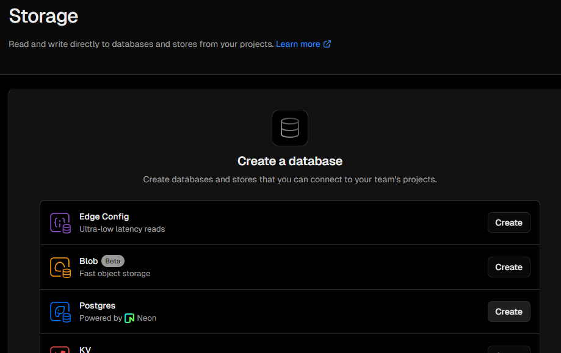

こちらにアクセス
[vercel.com/signup](https://vercel.com/signup)

## 手順

1. Githubリポジトリを選択してimport
2. プロジェクトに名前を付けてDeploy
3. Postgresデータベースを作成する
    - Dashboard
    - Strageタブ
    - Postgresを選択
    - 規約に同意してCreate
    - Projectと接続する「Connect Project」
    - .env.localタブを表示し、「Copy Snippet」でコピーする
    - .envファイルに貼り付ける



4. Vercel Postgres SDKをインストール
```sh
pnpm i @vercel/postgres
```


